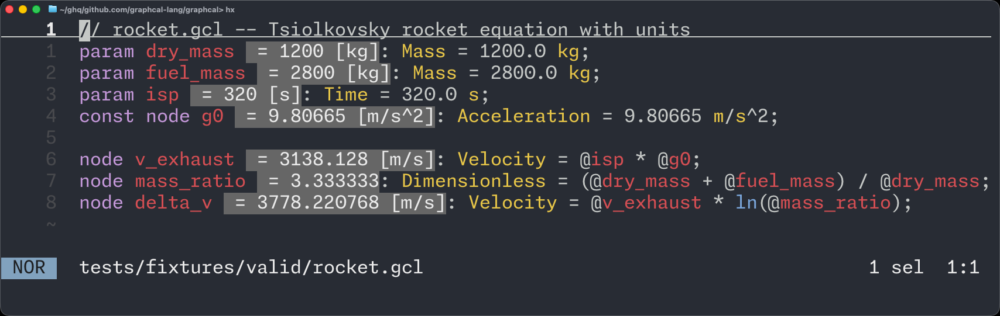

<h1 align="center">
  
</h1>

> [!WARNING]
> Graphcal is under active development. Expect breaking changes and bugs.



*The Tsiolkovsky rocket equation in Graphcal. The language server shows computed values inline, turning a text file into a live engineering worksheet.*

[Try this example in the browser playground](https://graphcal.org/playground/?example=rocket) without installing anything.

## Why Graphcal?

For engineers who want more confidence than spreadsheets and ad-hoc scripts provide:

- **Type- and unit-safe:** dimensional mistakes such as `km + kg` are rejected at compile time.
- **Reactive:** changing a parameter recomputes its dependents.
- **Git-friendly:** `.gcl` files are plain text and diff cleanly.
- **Editor-friendly:** the LSP provides diagnostics, references, rename, and inline computed values.

## Quickstart

Install the CLI with [Rust](https://rustup.rs/):

```sh
# The version flag is needed while Graphcal is a pre-release.
cargo install graphcal --version '^0.0.1-alpha' --locked
```

Save [`rocket.gcl`](tests/fixtures/valid/rocket.gcl), the file shown above, then run:

```sh
graphcal eval rocket.gcl
# Change an input; dependent values recompute:
graphcal eval rocket.gcl --param 'isp=450.0 s'
# Build a self-contained interactive HTML report (experimental):
graphcal report build rocket.gcl
```

## Documentation

Everything else is in the [documentation](https://graphcal.org/docs/): the [tutorial](https://graphcal.org/docs/tutorial/), the [editor setup guide](https://graphcal.org/docs/editor-setup/) for VS Code, Zed, Neovim and Helix, and the language and CLI references.

## Design influences

- [Numbat](https://numbat.dev) — dimensions as types, units as values
- [Gleam](https://gleam.run) — unified type declarations
- [marimo](https://marimo.io) — reactive graphs in plain-text files
- [Sguaba](https://github.com/helsing-ai/sguaba) — typed coordinate frames

## License

Licensed under either the [MIT License](LICENSE-MIT) or [Apache License, Version 2.0](LICENSE-APACHE), at your option.
