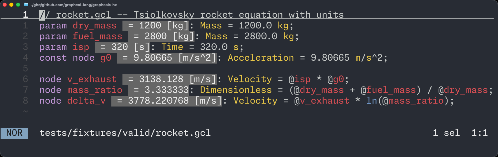

# Welcome to Graphcal

Graphcal is a **type-safe, unit-aware, Git-friendly reactive programming language** for engineering calculations. It replaces spreadsheets and ad-hoc scripts with a single typed, version-controlled computation graph.



*Graphcal's language server shows computed node values inline, so a plain-text calculation file feels like a live engineering worksheet.*

## Quick Example

The Tsiolkovsky rocket equation in Graphcal:

```
// `Velocity` and `Acceleration` are prelude dimensions.

param dry_mass: Mass = 1200.0 kg;
param fuel_mass: Mass = 2800.0 kg;
param isp: Time = 320.0 s;
const node g0: Acceleration = 9.80665 m/s^2;

node v_exhaust: Velocity = @isp * @g0;
node mass_ratio: Dimensionless = (@dry_mass + @fuel_mass) / @dry_mass;
node delta_v: Velocity = @v_exhaust * ln(@mass_ratio);
```

Run it:

```bash
$ graphcal eval rocket.gcl
dry_mass   = 1200 kg
fuel_mass  = 2800 kg
isp        = 320 s
g0         = 9.80665 m/s^2
v_exhaust  = 3138.128 m/s
mass_ratio = 3.333333
delta_v    = 3778.220768 m/s
```

## Why Graphcal?

- **Type safety** -- Dimension mismatches are caught at compile time.
- **Unit awareness** -- Define physical dimensions, attach units, and convert between them. The compiler enforces dimensional consistency. No more [Mars Climate Orbiter](https://en.wikipedia.org/wiki/Mars_Climate_Orbiter) failures.
- **Reactive computation** -- Define a DAG of parameters and nodes. Change an input and all dependent values update automatically.
- **Git-friendly** -- Plain text `.gcl` files that diff and merge cleanly. No binary spreadsheets.
- **Live editor experience** -- The LSP server provides inlay hints that display computed values inline, turning your editor into a live calculation sheet.

## Getting Started

<div class="grid cards" markdown>

- :material-download:{ .lg .middle } **Installation**

    ---

    Install Graphcal from crates.io using Cargo.

    [:octicons-arrow-right-24: Install Graphcal](installation.md)

- :material-school:{ .lg .middle } **Tutorial**

    ---

    Learn Graphcal step by step with hands-on examples.

    [:octicons-arrow-right-24: Start the tutorial](tutorial/index.md)

- :material-book-open-variant:{ .lg .middle } **Language Reference**

    ---

    Formal documentation of all language features.

    [:octicons-arrow-right-24: Language reference](language/index.md)

- :material-console:{ .lg .middle } **CLI Reference**

    ---

    Complete command-line interface documentation.

    [:octicons-arrow-right-24: CLI commands](cli-reference.md)

- :material-puzzle:{ .lg .middle } **Editor Setup**

    ---

    Install the VS Code extension, or set up Zed/Neovim with live inlay hints.

    [:octicons-arrow-right-24: Editor setup](editor-setup.md)

</div>
